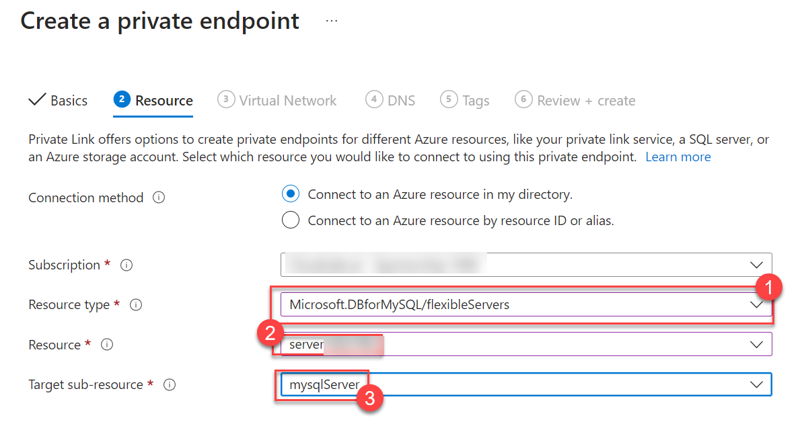
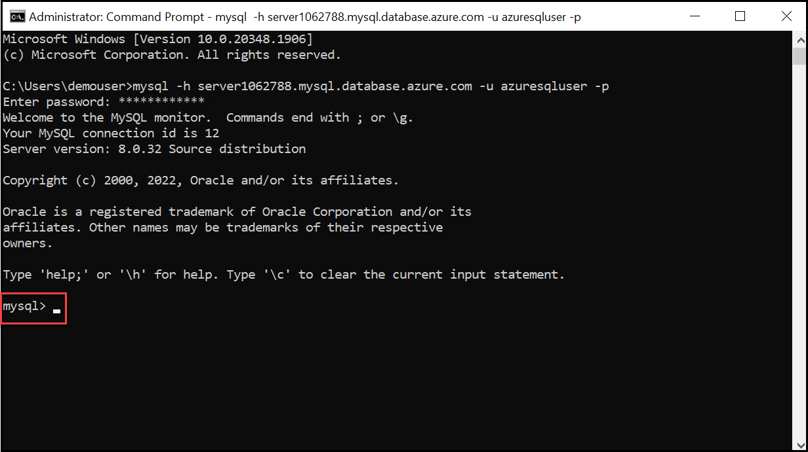

#

## Task 1: Create a private Endpoint.

1. On the search bar search for **private endpoints** and click on it

1. Click on **+Create**

1. leave the subscription as default

1. For the resource group select **jumpvm[DID]**

1. For the name type **endpoint[did]**

1. Leave the default value for nic card name. and select a region.

1. Click on **Next:resources**

1. Select **Connect to an Azure resource in my directory.** 

1. Leave the default subscription

1. For resource type search for **Microsoft.DBforMySQL/flexibleservers** and click on it.

1. Select the Database in the resource group created prior.

   

1. Click on **Next:virtualnetwork**

1. Select the existing virtual network and the existing subnet and leave the defaults

1. Click on **Next:DNS**

1. Select yes and select subscription and resource group and click on next and Review and create.

1. Click on create.

  >**Note**: It might take few minutes for the deployment to complete meanwhile observe the resources which are created with the endpoint.

## Task 2: Connect to azure database.

1. In the Azure Portal navigate to resource group and select Jumpvm-[did]

1. Select the created Azure database **server[did]**

1. On the left menu click on connect. and scroll down to **Connect from browser or locally**

1. Copy the command given.

   ```
   mysql -h server1062788.mysql.database.azure.com -u azuresqluser -p

   ```

1. In the system navigate to start and search for command prompt by typing **cmd** and select.

1. Paste the command you copied earlier. and press enter

1. For password type **Password.1!!**. click enter

1. You can see the mysql prompt.

     

## Proceed to next exercise

  

     
