# Lab-01: Create a private endpoint and establish connection to azure mysql database

## Lab scenario

You are tasked with setting up a private endpoint and establishing a secure connection to an Azure MySQL database from an on-premises environment. This lab scenario involves creating a private endpoint within the Azure portal and configuring it to connect to the Azure MySQL database. You will also learn how to use a command prompt to securely establish a connection to the Azure MySQL database.

## Lab objectives

In this lab you will perform:

+   Creating a private endpoint
+   Establishing connection to azure mysql database from onprem

## Estimated Timing: 30 minutes

### Task 1: Open the Azure portal

1. On desktop Click on **Azure portal(1)** shortcut

   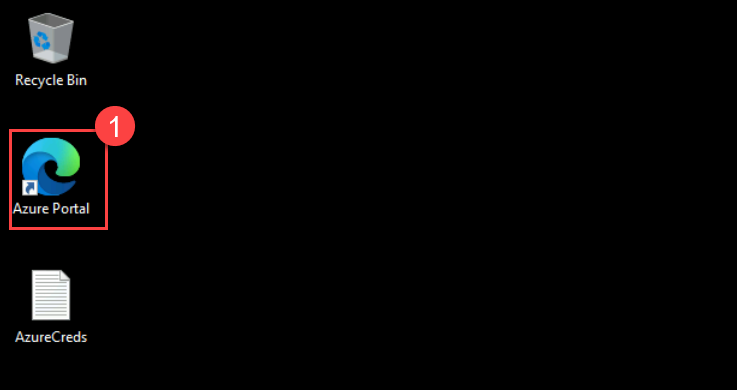

1. Click on continue without using data and continue browsing

1. Search for portal.azure.com  

1. If not Sign-in, then on the **Sign into Microsoft Azure** tab you will see the login screen, in that enter following **Email/Username** and then click on **Next**. 
   * Email/Username: <inject key="AzureAdUserEmail"></inject>

   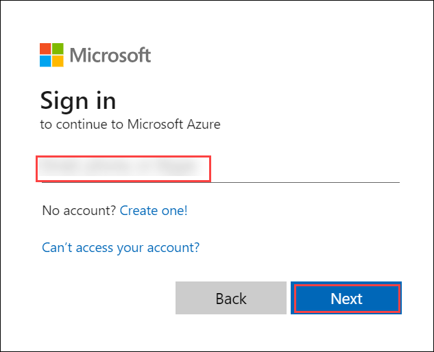
   
1. Now enter the following **Password** and click on **Sign in**.
   * Password: <inject key="AzureAdUserPassword"></inject>

   
    
1. If you see the pop-up **Stay Signed in?**, click No.

   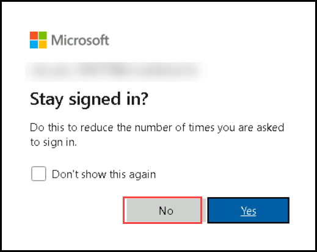

### Task 2: Create a private Endpoint.

1. On the search bar, search for **private endpoints(1)** and click on **private endpoints(2)**

   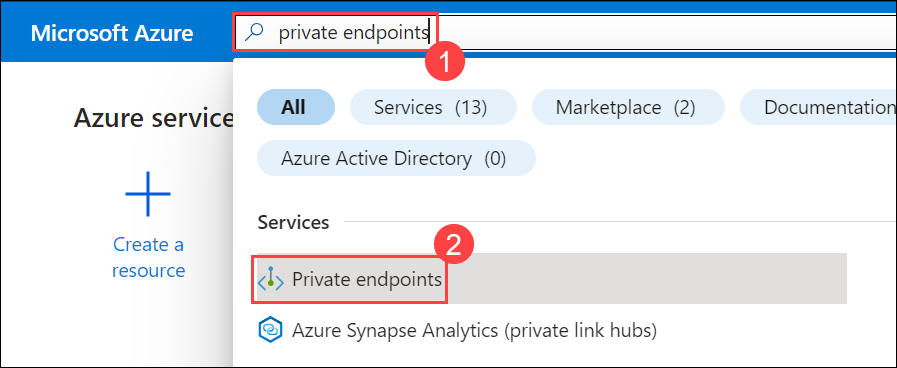

1. On the **private Link center| Private endpoints**, click on **+ Create(1)**

   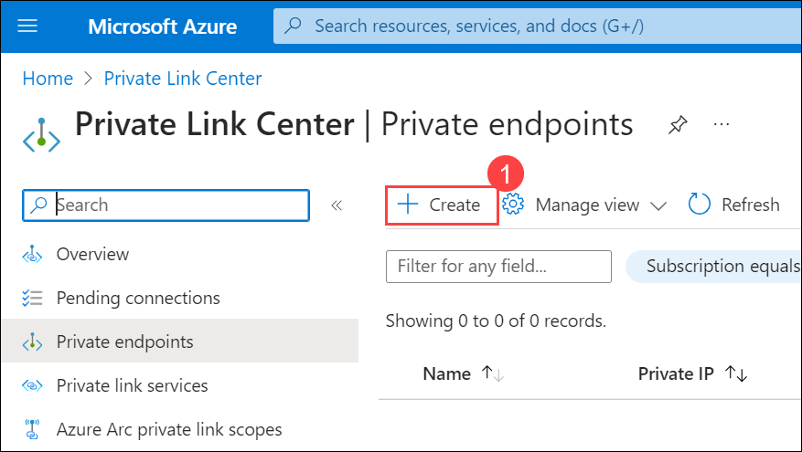

1. In the Creation screen enter the following details. Click on **Next: Resources(6)**

   - leave the **subscription(1)** as default

   - For the **resource group(2)**, select **JumpVM-RG-<inject key="Deployment ID" enableCopy="false"/>**

   - For the **Name(3)** type **endpoint-<inject key="Deployment ID" enableCopy="false"/>**

   - Leave the default value for **Nic card name(4)**. and select a **Region(5)**.

      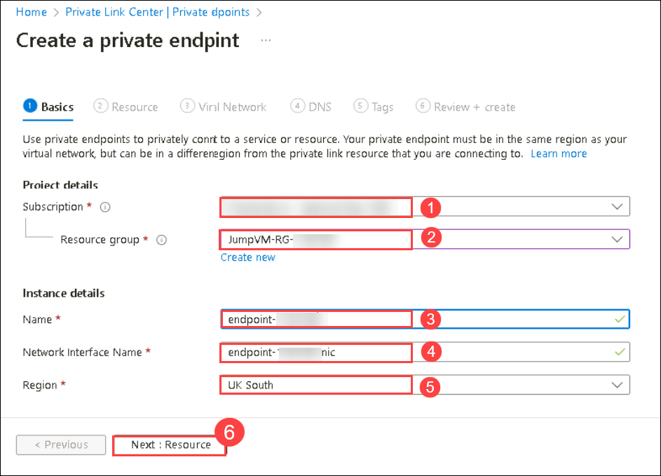

1. In **Resources Tab:** fill the below details and Click on **Next: Virtualnetwork(6)**

   - Select **Connect to an Azure resource in my directory(1)**. 

   - Leave the default **subscription (2)**

   - For **resource type(3)** type search for **Microsoft.DBforMySQL/flexibleservers** and click on it.

   - Select the **Database(4)** in the resource group created prior i.e **server<inject key="DeploymentID" enableCopy="false"/> (1)**.
   - For the **Target sub resource (5)** is already selected by default to mysqlServer

      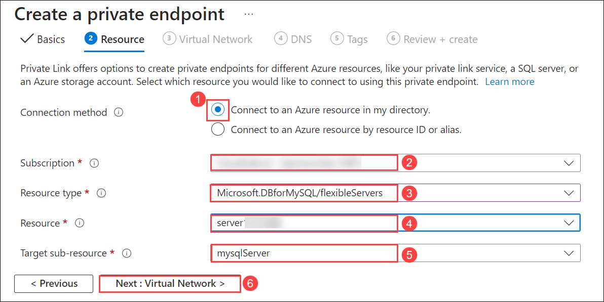

1. In the **Virtual network tab**, select the existing **Virtual network(1)** and the existing **Subnet(2)** and leave the defaults and Click on **Next: DNS(3)**
 
   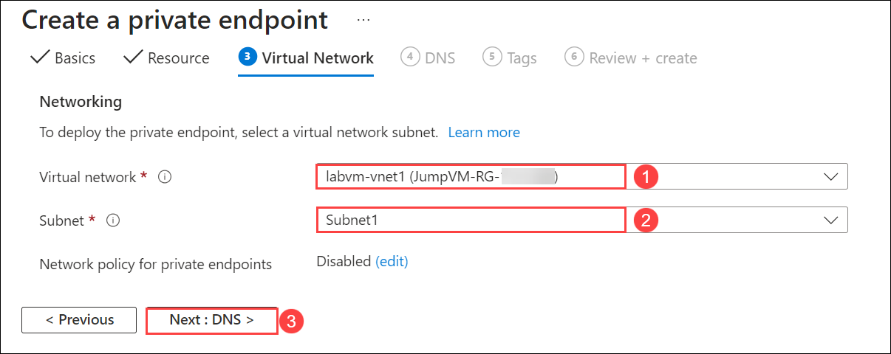

1. In DNS tab, select **yes(1)** for **Integrate with private DNS zone** and select available **subscription(2)** and for **resource group(3)** select **JumpVM-RG-<inject key="Deployment ID" enableCopy="false"/>**  and click on next tags and again click **next**.

   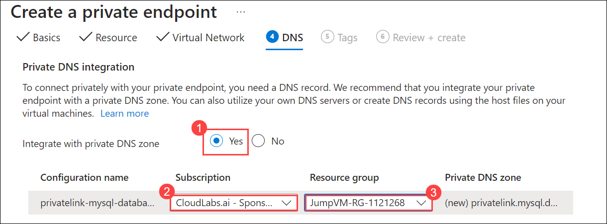

1. In Review + create page Click on **create(1)**.

   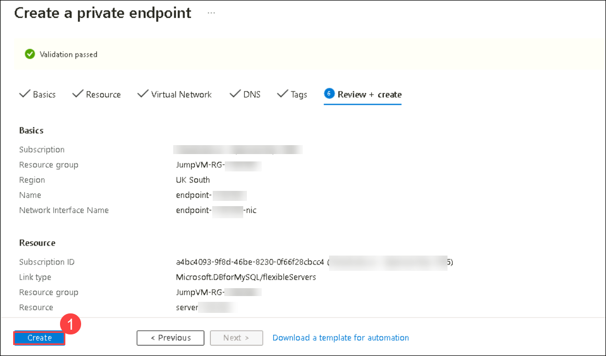

  >**Note**: It might take few minutes for the deployment to complete meanwhile observe the resources which are created with the endpoint.

### Task 3: Connect to azure database.

1. In the Azure Portal, navigate to resource group and select **Jumpvm-<inject key="Deployment ID" enableCopy="false"/>**

   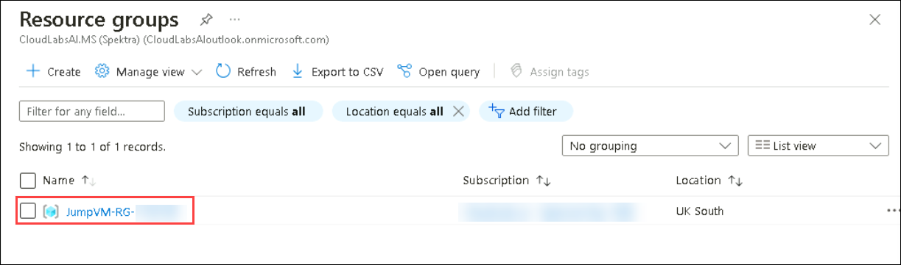

1. Select the created Azure database server **server<inject key="DeploymentID" enableCopy="false"/> (1)**

   

1. On the left menu of **server<inject key="DeploymentID" enableCopy="false"/>** under settings, click on **connect(1)**.

   

1. Under the prerequisites check, and click on **Add Client IP ( xxxx )(1)**. Wait until it gets updated.

   

   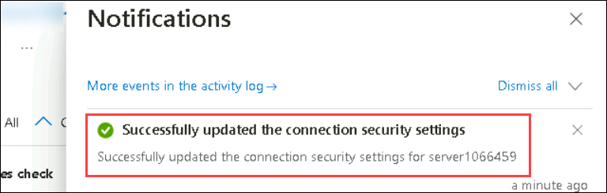

1. After the configuration, Scroll down to **Connect from browser or locally**. **Copy(1)** the given command in the notepad.

   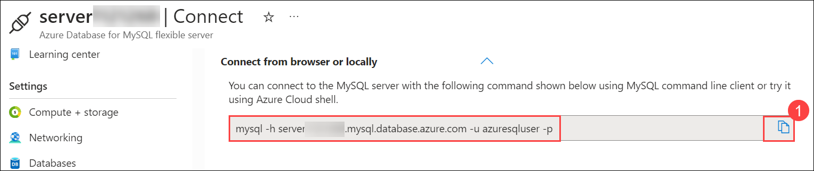

1. In the Labvm, navigate to start and search for command prompt by typing **cmd** and select.

   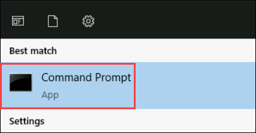

1. On the command prompt **Paste the command(1)** you copied earlier, hit **enter**, enter the password as **Password.1!!**. Hit **enter**.

   

1. You can view the mysql prompt.

   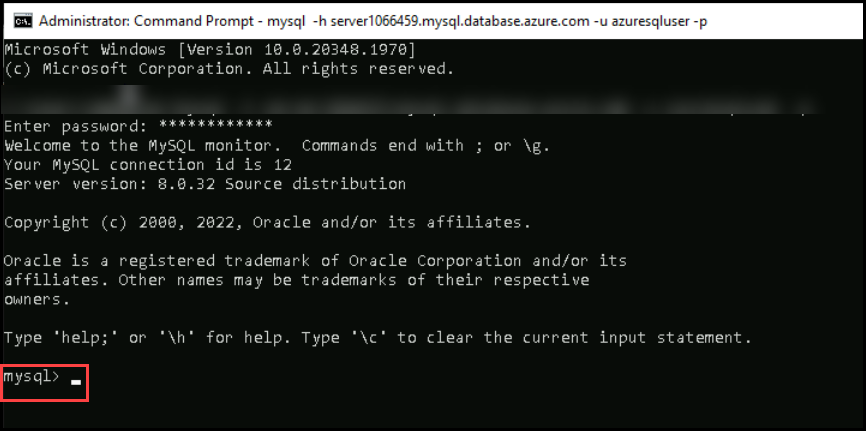

## Review

1. In this lab you have Created an Azure Private Endpoint for secure MySQL database access.

1. Configured and connected the endpoint through the Azure Portal.

1. Established a secure connection using a command prompt, enhancing data security and control.

## Proceed to next Lab

