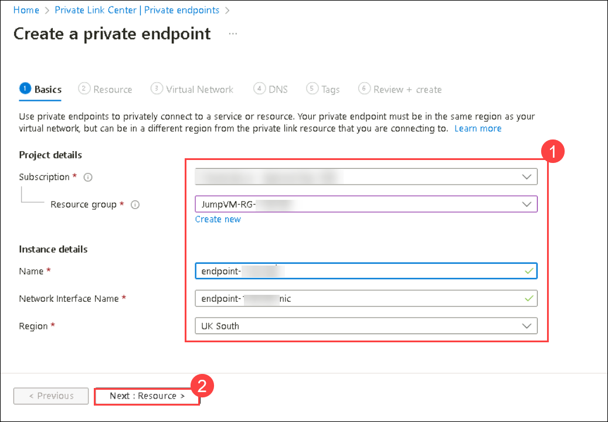

# Lab-01: Create a private endpoint and establish connection to azure mysql database

## Lab scenario

You are tasked with setting up a private endpoint and establishing a secure connection to an Azure MySQL database from an on-premises environment. This lab scenario involves creating a private endpoint within the Azure portal and configuring it to connect to the Azure MySQL database. You will also learn how to use a command prompt to securely establish a connection to the Azure MySQL database.

## Lab objectives

In this lab you will perform:

+   Creating a private endpoint
+   Establishing connection to azure mysql database from onprem

## Estimated Timing: 30 minutes

### Task 1: Open the Azure portal

1. On desktop Click on **Azure portal** shortcut

   

1. Click on continue without using data and continue browsing

1. Search for portal.azure.com  

1. If not Sign-in, then on the **Sign into Microsoft Azure** tab you will see the login screen, in that enter following **Email/Username** and then click on **Next**. 
   * Email/Username: <inject key="AzureAdUserEmail"></inject>

   
   
1. Now enter the following **Password** and click on **Sign in**.
   * Password: <inject key="AzureAdUserPassword"></inject>

   
    
1. If you see the pop-up **Stay Signed in?**, click No.

   

### Task 2: Create a private Endpoint.

1. On the search bar, search for **private endpoints** and click on it

   

1. Click on **+Create**

   

1. In the Creation screen.

   - leave the subscription as default

   - For the resource group, select **jumpvm-RG-<inject key="DeploymentID" />**

   - For the name type **endpoint-<inject key="DeploymentID" />**

   - Leave the default value for nic card name. and select a region.

1. Click on **Next:resources**

   

1. In **Resources Tab:**

   - Select **Connect to an Azure resource in my directory.** 

   - Leave the default subscription

   - For resource type search for **Microsoft.DBforMySQL/flexibleservers** and click on it.

   - Select the Database in the resource group created prior.

1. Click on **Next:virtualnetwork**

   

1. Select the existing virtual network and the existing subnet and leave the defaults

1. Click on **Next:DNS**

   

1. Select yes and select subscription and resource group and click on next tags and again click next.

   

1. Click on create.

   

  >**Note**: It might take few minutes for the deployment to complete meanwhile observe the resources which are created with the endpoint.

### Task 3: Connect to azure database.

1. In the Azure Portal, navigate to resource group and select Jumpvm-<inject key="DeploymentID" />

   

1. Select the created Azure database **server<inject key="DeploymentID" />**

   

1. On the left menu, click on connect.

   

1. Check the prerequisites and click on **Add Client IP ( xxxx )**. Wait until it gets updated.

   

   

1. After the configuration, Scroll down to **Connect from browser or locally**. Copy the command given.

   

1. In the system, navigate to start and search for command prompt by typing **cmd** and select.

   

1. Paste the command you copied earlier. and press enter

1. For password, type **Password.1!!**. click enter

   

1. You can see the mysql prompt.

     

## Review

1. In this lab you have Created an Azure Private Endpoint for secure MySQL database access.

1. Configured and connected the endpoint through the Azure Portal.

1. Established a secure connection using a command prompt, enhancing data security and control.

## Proceed to next Lab

  

     
