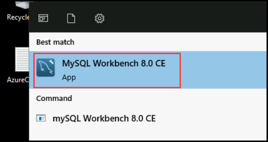
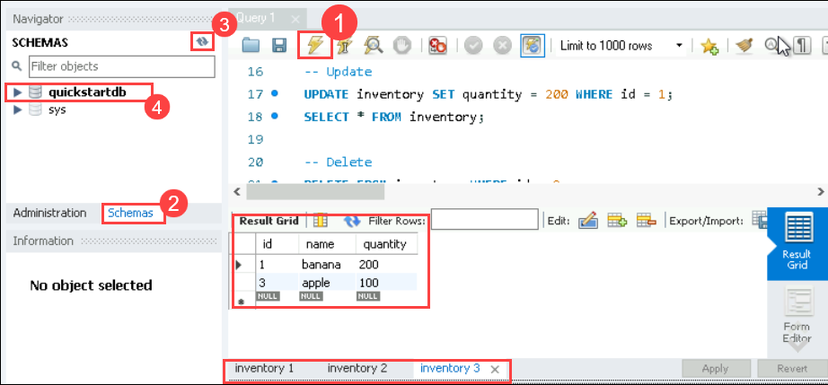

# Lab 02:Creating a MySQL Database with MySQL Workbench

## Lab Scenario

In this lab, you'll create a database using MySQL Workbench. Simply launch MySQL Workbench, execute a provided query to create a "quickstartdb" and "inventory" table with sample data, and verify their creation in the left panel's schema view.This exercise provides practical experience in database creation and management with MySQL Workbench.

## Lab objective

In this lab you will perform:

+   creating a MySQL database using Workbench

## Estimated Timing: 10 minutes

### Task 1: Create a Database using MySQL workbench

1. In the desktop select start menu

1. Search for MySQL workbench.

   

1.  Click on the Default instance created.

   

1. Once the editor opens up copy paste the below query to create a database and a table

   >**Note**: Please copy-paste the commands in the notepad before pasting it inside the editor to avoid mistakes.  

     ```
     -- Create a database
     -- DROP DATABASE IF EXISTS quickstartdb;
     CREATE DATABASE quickstartdb;
     USE quickstartdb;
     
     -- Create a table and insert rows
     DROP TABLE IF EXISTS inventory;
     CREATE TABLE inventory (id serial PRIMARY KEY, name VARCHAR(50), quantity INTEGER);
     INSERT INTO inventory (name, quantity) VALUES ('banana', 150);
     INSERT INTO inventory (name, quantity) VALUES ('orange', 154);
     INSERT INTO inventory (name, quantity) VALUES ('apple', 100);
     
     -- Read
     SELECT * FROM inventory;
     
     -- Update
     UPDATE inventory SET quantity = 200 WHERE id = 1;
     SELECT * FROM inventory;
     
     -- Delete
     DELETE FROM inventory WHERE id = 2;
     SELECT * FROM inventory;
     
     ```
1. Click on the execute button which looks like thunderbolt.

1. verify the **created table**.

1. Verify the created **database** by viewing **schema** on the left **(refresh it)**

   
   
  >**Note:** Don't close the page as the steps are continued in the next exercise.

## Review

1. You launched MySQL Workbench and opened the default instance.

1. You executed a provided query to create a database named "quickstartdb" and a table called "inventory" with sample data.

1. The query was executed successfully, and you verified the creation in the left panel's schema view.

1. You kept this page open for future exercises.

## Proceed to next Lab.

