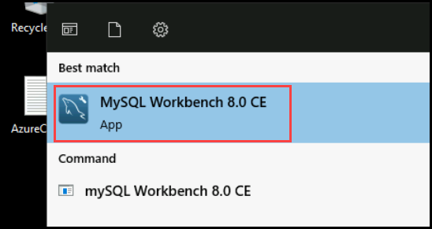
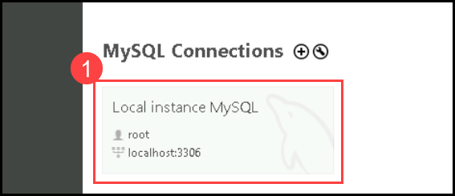
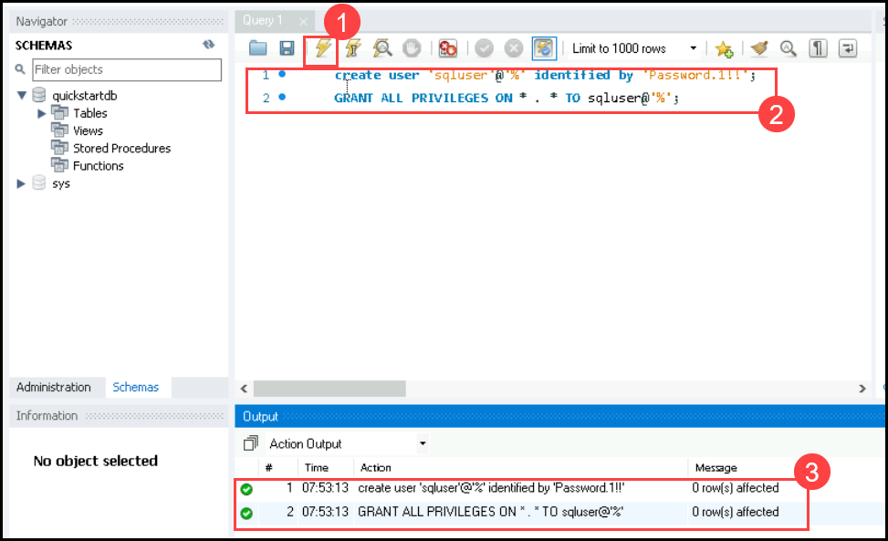
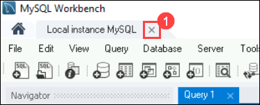
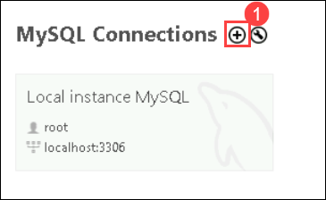
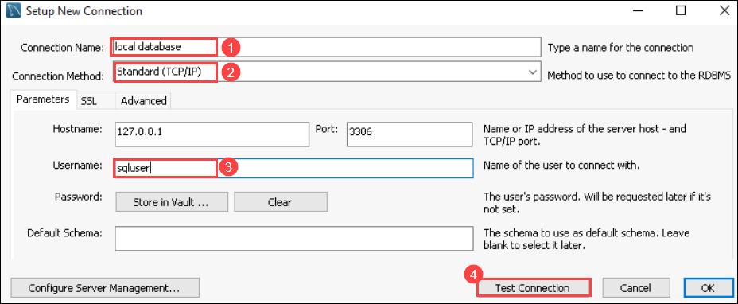
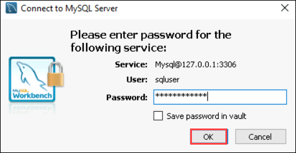
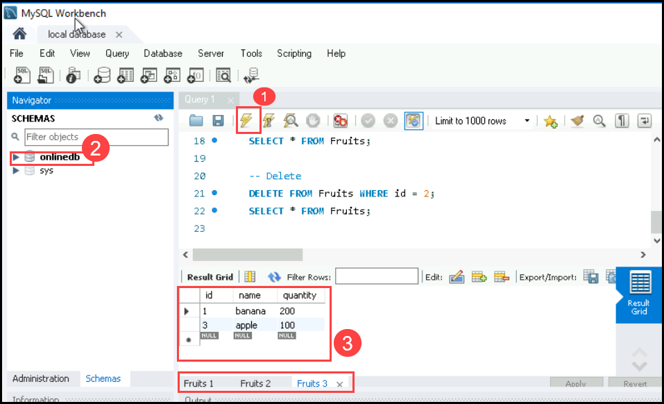

# Lab 04:Creating another Database to demonstrate Online migration

## Lab Scenario

In this lab, you'll create a database using MySQL Workbench. Simply launch MySQL Workbench, execute a provided query to create a table with sample data, and verify their creation in the left panel's schema view. This exercise provides practical experience in database creation and management with MySQL Workbench.

## Lab objective:

In this lab, you will perform:

+   Task 01: Create a New MySQL user
+   Task 02: Create a new Database

## Estimated Timing: 20 minutes

### Task 01: Create a New MySQL user 

1. On the start menu search for MySQLworkbench and click on the **MySQLworkbench**.

   

1. On the home page of the workbench click on the created instance.

   

1. Delete if there is any content And copy and paste the below command. and Run it.

   ```
   create user 'sqluser'@'%' identified by 'Password.1!!';

   GRANT ALL PRIVILEGES ON * . * TO sqluser@'%';

   ```

   

   >**Note**:Copy-paste the commands in Notepad before pasting it into the editor to avoid mistakes

1. Close the instance,

   

1. Click on the add button "+" to set-up new connection.

   

1. In the setup new connection wizard fill the following details:

   -   When the new connection screen pops up, **Name(1)** the connection as **local database**.

   -   Leave the **Connection Method(2)** as default.

   -   For the **Username(3)** type **sqluser** and click on **Test connection(4)**.

   -   Enter the password as **Password.1!!**.

   -   Once you get the success message click on **ok**.

      

      

### Task 02: Create a new Database

1. In the Workbench Home page select the created connection **local database**.

1. In the query section copy and **paste** the below query command to create a sample database and table.

   ```
     -- Create a database
     -- DROP DATABASE IF EXISTS onlinedb;
     CREATE DATABASE onlinedb;
     USE onlinedb;
     
     -- Create a table and insert rows
     DROP TABLE IF EXISTS Fruits;
     CREATE TABLE Fruits (id serial PRIMARY KEY, name VARCHAR(50), quantity INTEGER);
     INSERT INTO Fruits (name, quantity) VALUES ('banana', 150);
     INSERT INTO Fruits (name, quantity) VALUES ('orange', 154);
     INSERT INTO Fruits (name, quantity) VALUES ('apple', 100);
     
     -- Read
     SELECT * FROM Fruits;
     
     -- Update
     UPDATE Fruits SET quantity = 200 WHERE id = 1;
     SELECT * FROM Fruits;
     
     -- Delete
     DELETE FROM Fruits WHERE id = 2;
     SELECT * FROM Fruits;
     
     ```
    

1. Click on the **execution button(1)** to execute the query **refresh schema to see the new database named onlinedb(2)**. and you can see the database with a **Table(3)** has been created.

   

## Review

1. You launched MySQL Workbench and opened the default instance.

1. You executed a provided query to create a database named "onlinedb" and a table called "fruits" with sample data.

1. The query was executed successfully, and you verified the creation in the left panel's schema view.

## Proceed to the next Lab.
