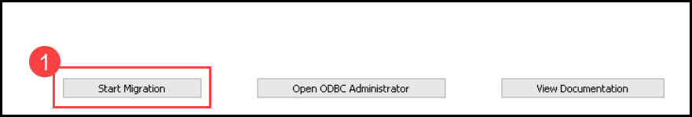
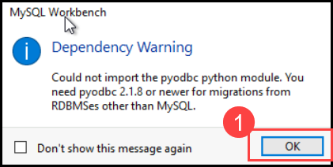
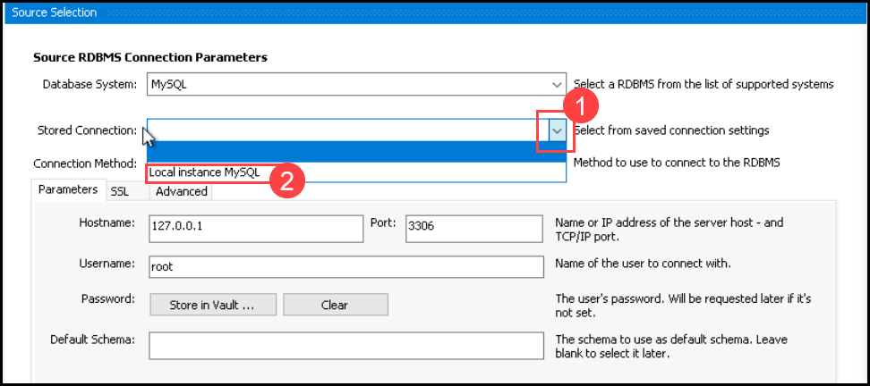
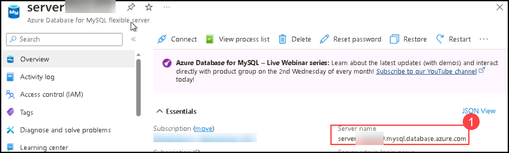
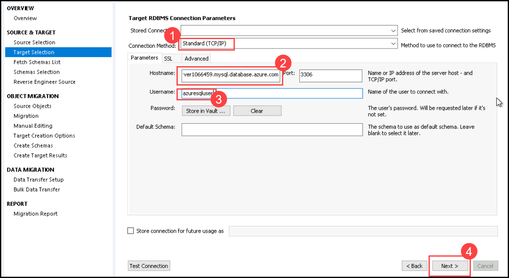
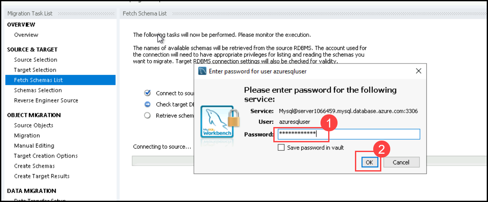
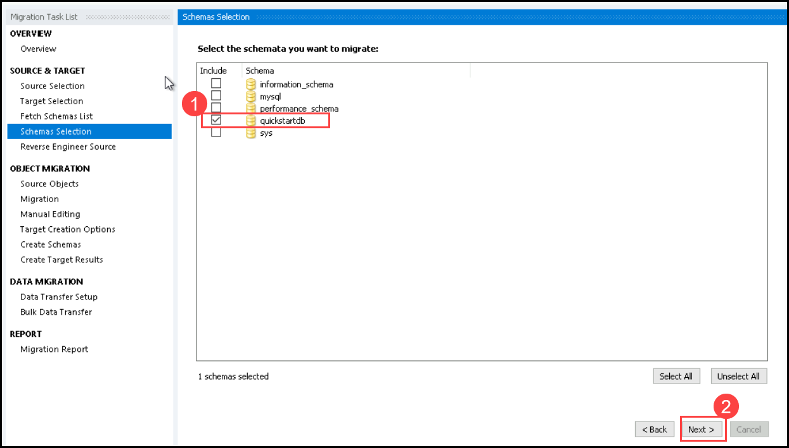
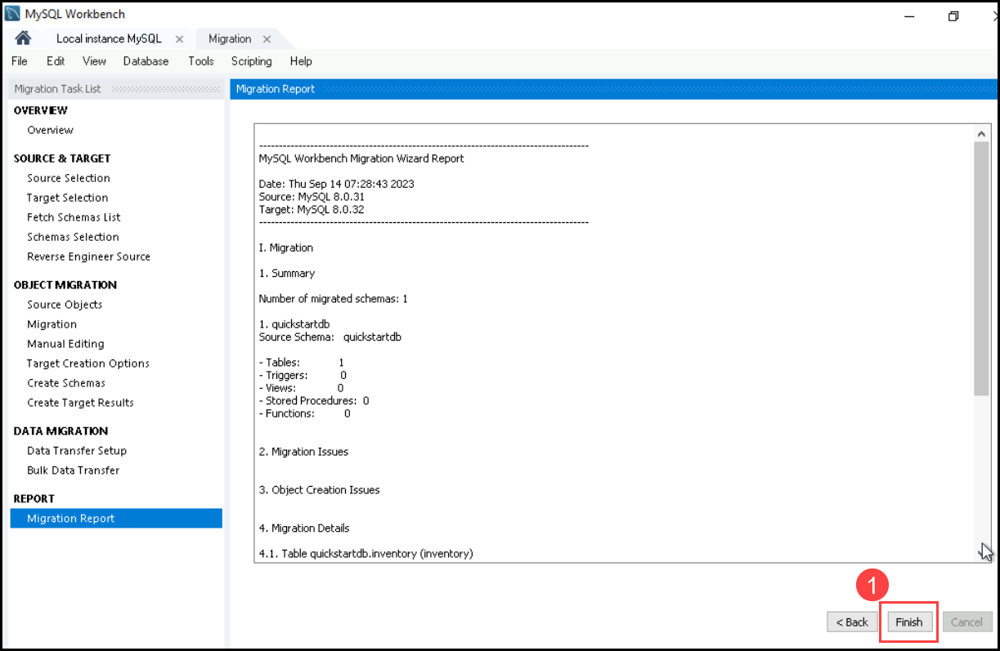
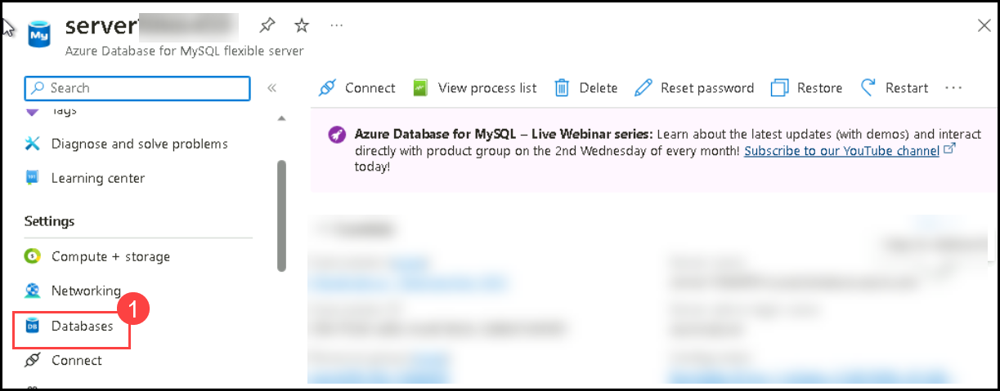
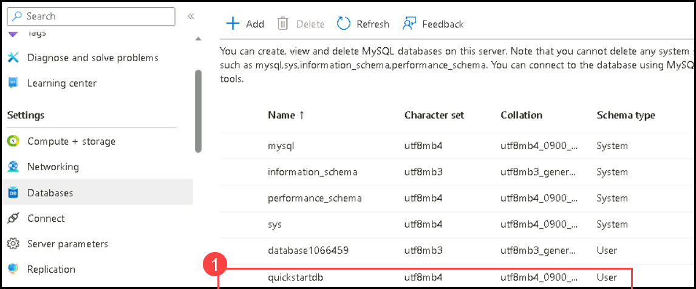

# Exercise 03: Migrating a Database to Azure MySQL

In this lab, you'll migrate a database from MySQL Workbench to Azure MySQL. Using the Migration Wizard in MySQL Workbench, you'll configure source and target settings, test the connection, and complete the migration. Afterward, in the Azure portal, you'll verify the successful migration of the database within the specified resource group. This exercise demonstrates the efficient transfer of a database to Azure's cloud environment.

## Task 01: Migrate the created database to azure MySQL database

1. In MYSQL workbench On Tool bar select **Database**

1. In the drop-down select **Migration wizard**

   

1. Click on **Start Migration**.

1.  Click Ok on the dependency warning.

   

   

1.  In the Source Selection wizard choose **mysql** for the database system.

1. For the stored connection select **Local instance MySQL** and choose **Standard TCP/IP** for connection method

1. Click on Next

   

   

1. In the Target Selection wizard Choose **Standard TCP/ip** for connection method.

1. In the below parameters Copy paste the Database Servername from portal in the place of **host name**

   

1. Enter the username as well **azuresqluser**

1. Click on **next** Type the password **Password.1!!** once the success message pops up click on Ok.

   

   

1. Click on Next until **schema selection** choose the created database **quickstartdb** and click on next.

   

   

1. Click on Next Until Migration report (wait for few seconds each time you click next)

1. In the migration report review the settings and click on **finish**.

   

## Task 2: Review the migrated database

1. Go to azure portal and select the existing resource group

1. Navigate to the azure database **Server-<inject key="DeploymentID" />**

1. On the left menu search for databases and select it.

   

1. You can see the Database has been successfully migrated.

   

## Review

1. You initiated the database migration from MySQL Workbench to Azure MySQL, configuring source and target settings.

1. You successfully completed the migration process.

1. In the Azure portal, you verified the migrated database's status within the specified resource group.

## Proceed to next exercise   
