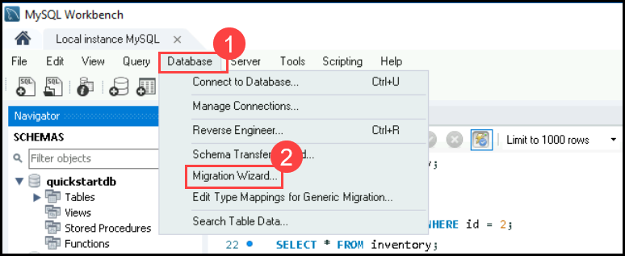
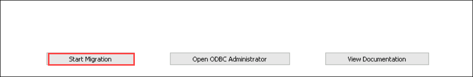
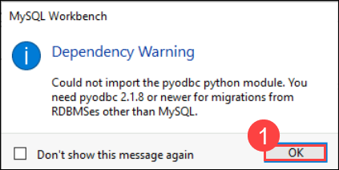
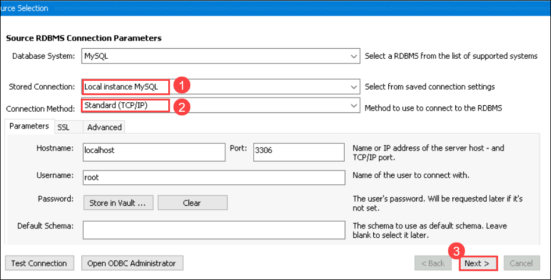
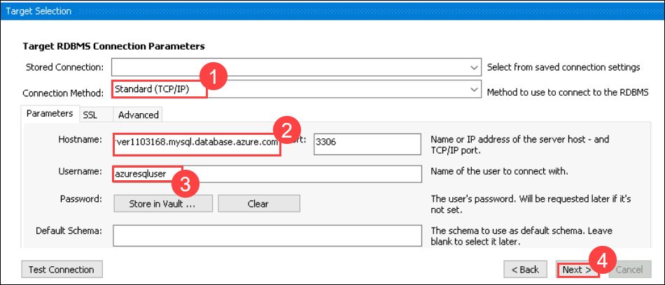
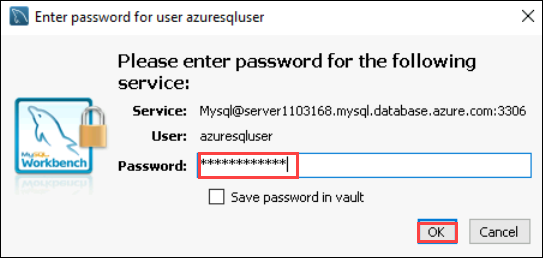
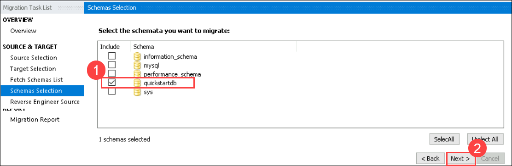
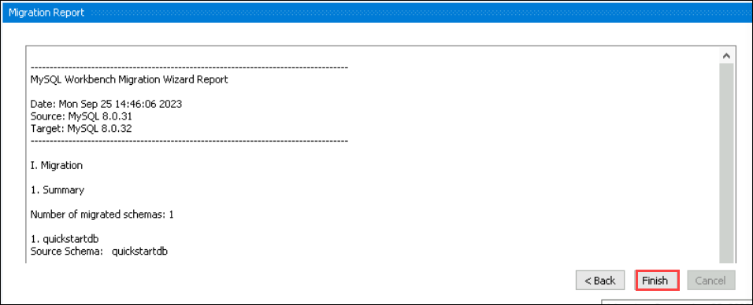
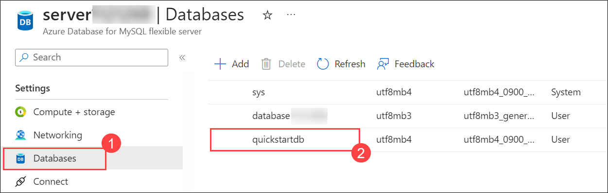

# Lab 03: Migrating a Database to Azure MySQL

## Lab Scenario

In this lab, you'll migrate a database from MySQL Workbench to Azure MySQL. Using the Migration Wizard in MySQL Workbench, you'll configure source and target settings, test the connection, and complete the migration. Afterward, in the Azure portal, you'll verify the successful migration of the database within the specified resource group. This exercise demonstrates the efficient transfer of a database to Azure's cloud environment.

## Lab objectives:

In this lab, you will perform:

+   Task 01: Migrate the created database to Azure MySQL database
+   Task 02: Review the migrated database

## Estimated Timing: 30 minutes

### Task 01: Migrate the created database to Azure MySQL database

1. In MYSQL workbench On Tool bar select **Database(1)**. In the drop-down select **Migration wizard(2)**

   

1. Click on **Start Migration**. And when the pop-up shows up Click **Ok(1)** on the Dependency Warning.

   

   

1.  In the Source Selection wizard choose **MySQL** for the database system. For the stored connection select **Local instance MySQL(1)**, leave **Standard TCP/IP(2)** as default for connection method and click on **Next(3)**

      

1. In the Target Selection wizard enter the following details and Click on **next**.

   -   Choose **Standard TCP/ip(1)** for connection method.

   -   In the below parameters Copy paste the Database Server name from the portal in the place of **hostname(2)**
  
   ```
     server[DID].mysql.database.azure.com
   ```
   
   >**Note** Replace [DID] with deployment ID <inject key="DeploymentID" />

   -   Enter the **username(3)** as well **azuresqluser**

   -   Enter the password ****<inject key="DBpasswd"></inject>**** Once the success message pops up click on Ok.

      

      

1. On fetch schema list Click on **Next**

1. In **Schema Selection** choose the created database **quickstartdb(1)** and click on **Next(2)**.

   

1. Click on **Next** Until the Migration report (wait for a few seconds each time you click next)

1. In the migration report review the settings and click on **finish**.

   

### Task 2: Review the migrated database

1. Go to the Azure portal and select the existing resource group **JumpVM-RG-<inject key="Deployment ID" enableCopy="false"/>**

1. Navigate to the azure database **Server-<inject key="DeploymentID" />**

1. On the left menu of **Server-<inject key="DeploymentID" />** under settings search for **Databases(1)** and select it. Under **Databases** you can **view(2)** the **quickstartdb** Database has been successfully migrated.

   

## Review

1. You initiated the database migration from MySQL Workbench to Azure MySQL, configuring source and target settings.

1. You successfully completed the migration process.

1. In the Azure portal, you verified the migrated database's status within the specified resource group.

## Proceed to the next Lab
