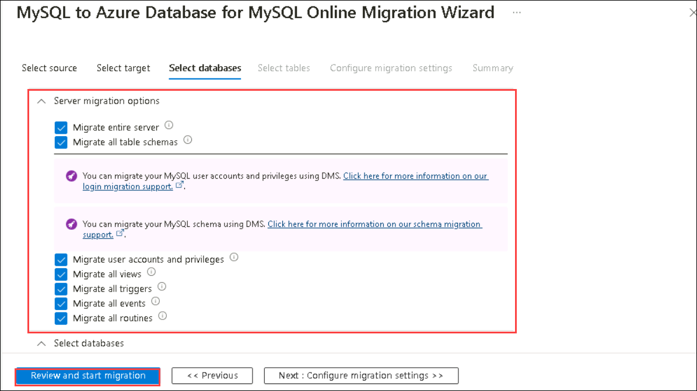

# Lab 05: Online Data Migration with Azure DMS: MySQL to Azure Database for MySQL via Azure Portal

## Lab Scenario

In this lab, you'll use the Azure portal to migrate data from a MySQL source server to an Azure Database for MySQL. The steps involve setting up a migration project, configuring source and target servers, starting the migration, and verifying its completion.

## Lab Objectives:

In this lab you will perform:

+   Create a new migration project for migrating data from MySQL to Azure Database for MySQL.
+   Configure source and target servers for the migration.
+   Initiate the migration process.
+   Verify the completion of the migration.

## Estimated Timing: 30 minutes

### Task 01: Set-up a new migration project

1. In the browser search for **portal.azure.com**. Enter the credentials and sign up

1. In the azure portal go to resource group. and Select the **Labvm-<inject key="Deployment ID" enableCopy="false"/>**

   

1. In the overview page **copy** the **IP address** in a Notepad. You will use it for later in this lab

   

1. Go back to Resource group. Select the data migration service **service<inject key="Deployment ID" enableCopy="false"/>**.

   

1. In the overview click on **+New Migration project**

   

1. In the **New Migration project window** Enter the below details and Click on **Create Run Activity(5)**

   - For **Project Name(1)** Type **Migration-<inject key="Deployment ID" enableCopy="false"/>**

   - For **Source server type(2)** choose MySQL from the drop down

   - For **Target server type(3)** choose **azure database for for MySQL (single or flexible)**

   - For **Migration activity type(4)** choose Online migration.

   

1. You can see it creates an activity and redirects you to **MySQL to Azure Database for MySQL Online Migr: ation Wizard**. And then Click on **Next Select Target**. (It might take a moment to load.)

1. In **MySQL to Azure Database for MySQL Online Migration Wizard** fill out the information as mentioned below and uncheck **encrypt connection** and click on **Next: Select Target**

    | Setting                          | Action                           |
    | -------------------------------- | -------------------------------- |
    | **Server name(1)**               | mention the **ip address** of the lab vm which you copied earlier |
    | **Port(2)**                      | **3306** | 
    | **Username(3)**                  | **sqluser**|
    | **Password(4)**                  | **Password.1!!** |

    

1. On the **Target tab** fill the below details and Click on Next **select Database(7)** 

    | Setting                          | Action                           |
    | -------------------------------- | -------------------------------- |
    | **Subscription(1)** drop-down list  | Retain the default value.        |
    | **Location(2)**                     | Select the region of your resource group                         |
    | **Resource Group(3)**               | Jumpvm-RG-<inject key="Deployment ID" enableCopy="false"/>                  |
    | **Azuredatabse for mysql server(4)**  | Select Server<inject key="Deployment ID" enableCopy="false"/>             |
    | **Username(5)**                      | azuresqluser                    |
    | **Password(6)**                      | Password.1!!                    |

   

1. In the **database tab** select **migrate entire servers**

1. Click on **Review and start migration**

   

1. In the Review page give a name for the activity in this case name it **migrate** and click on **Start migration**

1. You can see the migration process gets started

1. In the initial load you can see the created database has been migrated.

   

1. Wait until the status says completed.

1. Once the status shows completed To Review you can go back to server and check the newly migrated database.

   

1. To check Whether everything gets updated as changes are made in the local server go back to workbench and create a new database.

   ```
    CREATE DATABASE onlinedbtwo;

   ```
1. Execute the command and verify the creation in schemas tab.

   

1. Once created come back to azure database and refresh the database. you can see the creation of new database has been reflected.

   


## Review

1. In this lab, you performed a data migration from MySQL to Azure Database for MySQL using the Azure portal.

1. The process involved setting up the migration project, configuring source and target servers, and verifying the successful migration.

# You have successfully completed the lab


  
