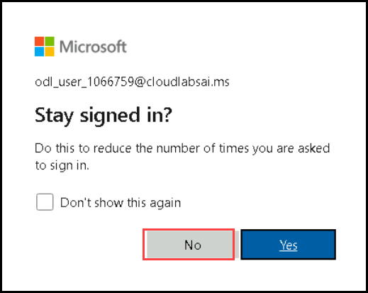

# Exercise 05: Online Data Migration with Azure DMS: MySQL to Azure Database for MySQL via Azure Portal

In this lab, you'll use the Azure portal to migrate data from a MySQL source server to an Azure Database for MySQL. The steps involve setting up a migration project, configuring source and target servers, starting the migration, and verifying its completion.

## Task 01: Open the Azure portal

1. On desktop click on **Azure Portal** shortcut

   

1. Click on continue without using data and continue browsing

1. Search for portal.azure.com  

1. If not Sign-in, then on the **Sign into Microsoft Azure** tab you will see the login screen, in that enter following **Email/Username** and then click on **Next**. 
   * Email/Username: <inject key="AzureAdUserEmail"></inject>

   
   
1. Now enter the following **Password** and click on **Sign in**.
   * Password: <inject key="AzureAdUserPassword"></inject>

   
    
1. If you see the pop-up **Stay Signed in?**, click No.

   

## Task 02: Set-up a new migration project

1. In the browser search for **portal.azure.com**

1. Enter the credentials and sign up

1. In the azure portal go to resource group.

   

1. Select the data migration service **service<inject key="DeploymentID" />**.

   

1. In the overview click on **+New Migration project**

   

1. In the **New Migration project window** Enter the details

   - For name Type **Migration-<inject key="DeploymentID" />**

   - For source server type choose MySQL from the drop down

   - For Target server type choose **azure database for for MySQL (single or flexible)**

   - For migration activity type choose Online migration.

1. Click on **Create Run Activity**

   

1. You can see it creates an activity and redirects you to **MySQL to Azure Database for MySQL Online Migration Wizard**.

1. In **MySQL to Azure Database for MySQL Online Migration Wizard** fill out the information as mentioned below

   - In select source tab For server name mention the ip address of the lab vm running in azure.

   >**Note**: Duplicate the current tab and go-to home page. From there go to resource group and navigate to **Labvm-<inject key="DeploymentID" />**.
   >   There you can find the Labvm IP address.

     
     
   - For port leave the default **3306**

   - For username type **sqluser** and for password type **Password.1!!**

   - Uncheck the **encrypt connection**

1. Click on **Next Select Target**. It might take a moment to load.

   

1. On the Target tab fill the below details and Click on Next **select Database** 

    | Setting                          | Action                           |
    | -------------------------------- | -------------------------------- |
    | **Subscription** drop-down list  | Retain the default value.        |
    | **Location**                     | East Us                          |
    | **Resource Group**               | Jumpvm-RG-<inject key="DeploymentID" />                  |
    | **Azuredatabse for mysql server**  | Select Server<inject key="DeploymentID" />             |
    | **Username**                      | azuresqluser                    |
    | **Password**                      | Password.1!!                    |

   

1. In the database tab select **migrate entire servers**

1. Click on **Review and start migration**

   

1. In the Review page give a name for the activity in this case name it **migrate** and click on **Start migration**

   

1. You can see the migration process gets started

1. In the initial load you can see the created database has been migrated.

   

1. Wait until the status says completed.

1. Once the status shows completed To Review you can go back to server and check the newly migrated database.

   

1. To check Whether everything gets updated as changes are made in the local server go back to workbench and create a new database.

   ```
    CREATE DATABASE onlinedbtwo;

   ```
1. Execute the command and verify the creation in schemas tab.

   

1. Once created come back to azure database and refresh the database. you can see the creation of new database has been reflected.

   


## Review

1. In this lab, you performed a data migration from MySQL to Azure Database for MySQL using the Azure portal.

1. The process involved setting up the migration project, configuring source and target servers, and verifying the successful migration.

# You have successfully completed the lab


  
